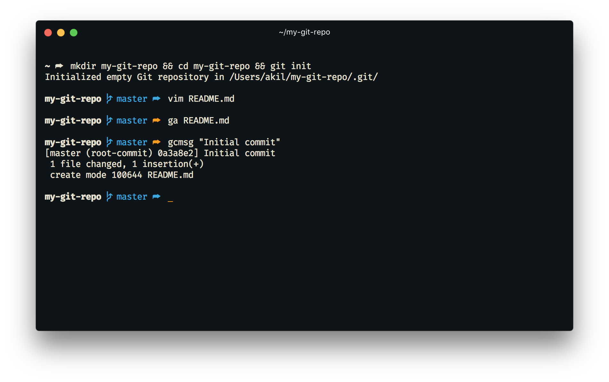

# Page Zsh Theme

_Page_ is a simple zsh theme with VCS support. The prompt shows 1 level of the current working directory, branch, and a color coded curved fat arrow.



## oh-my-zsh

### Installation

Copy the file to `$ZSH/custom/themes`:
```sh
cp page.zsh-theme $ZSH/custom/themes/page.zsh-theme
```

### Usage

In `.zshrc`, change the `ZSH_THEME` to "page":
```
ZSH_THEME="page"
```

## Contribution

This is my personal zsh theme I maintain for myself. Feel free to fork!
